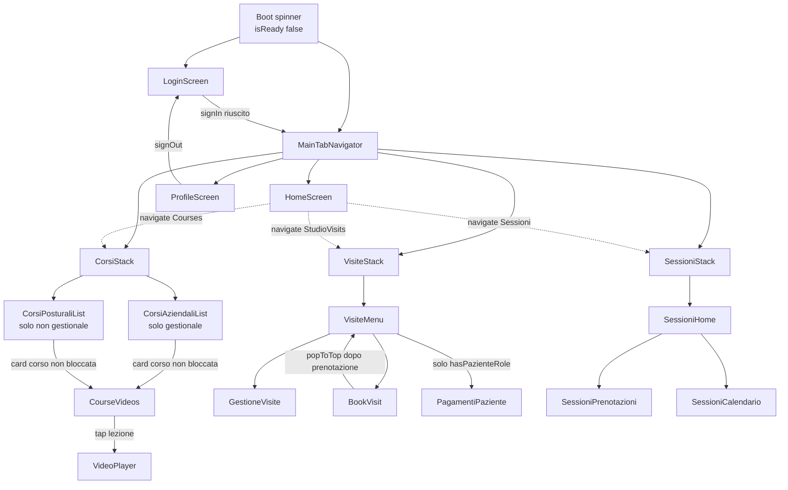

# 06 — Navigazione e mappa delle schermate

## 6.1 Struttura complessiva

L'app usa React Navigation v7 con tre livelli di annidamento:

```
NavigationContainer (theme personalizzato)
│
└── RootStack  (createStackNavigator, headerShown: false, cardStyle.paddingTop: 12)
    │
    ├── [!isSignedIn]  "Login"  → LoginScreen
    │
    └── [isSignedIn]   "Main"   → MainTabNavigator
        │
        ├── Tab "Home"          → HomeScreen                       (headerShown: false)
        │
        ├── Tab "Courses"       → CorsiStack                        (headerShown: false)
        │   │  initialRouteName dipende dal ruolo
        │   ├── "CorsiAziendaliList"  → CorsiAziendaliScreen   [solo se hasGestionaleRole]
        │   ├── "CorsiPosturaliList"  → CorsiPosturaliScreen   [solo se !hasGestionaleRole]
        │   ├── "CourseVideos"        → CourseVideosScreen      header 'Video del Corso'
        │   └── "VideoPlayer"         → VideoPlayerScreen       header 'Video'
        │
        ├── Tab "StudioVisits"  → VisiteStack                       (headerShown: false)
        │   │  initialRouteName: "VisiteMenu"
        │   ├── "VisiteMenu"          → VisiteMenuScreen        headerShown: false
        │   ├── "BookVisit"           → BookVisitScreen         header 'Prenota una nuova visita'
        │   ├── "GestioneVisite"      → GestioneVisiteScreen    header 'Gestisci le tue visite'
        │   └── "PagamentiPaziente"   → PagamentiPazienteScreen header 'I tuoi pagamenti'
        │
        ├── Tab "Sessioni"      → SessioniStack                     (headerShown: false)
        │   │  initialRouteName: "SessioniHome"
        │   ├── "SessioniHome"          → SessioniHomeScreen          headerShown: false
        │   ├── "SessioniPrenotazioni"  → SessioniPrenotazioniScreen  header 'Prenotazioni attive'
        │   └── "SessioniCalendario"    → SessioniCalendarioScreen    header 'Calendario sessioni'
        │
        └── Tab "Profile"       → ProfileScreen                     (headerShown: false)

NON MONTATO:
    FitnessStack
    ├── "FitnessCalendar"          → FitnessScreen                    headerShown: false
    ├── "FitnessBookings"          → FitnessBookingsScreen            header 'Prenotazioni attive'
    └── "FitnessSessionsCalendar"  → FitnessSessionsCalendarScreen    header 'Calendario Fitness'
```

Totale schermate raggiungibili: **14**. Schermate implementate ma non raggiungibili: **3** (fitness)
più il componente `SplashScreen`.

## 6.2 Root stack

`App.tsx:238-251`:

```typescript
<RootStack.Navigator screenOptions={{ headerShown: false, cardStyle: { paddingTop: 12 } }}>
  {!isSignedIn ? (
    <RootStack.Screen name="Login" component={LoginScreen} />
  ) : (
    <RootStack.Screen name="Main" component={MainTabNavigator} />
  )}
</RootStack.Navigator>
```

Le due schermate sono dichiarate condizionalmente, non semplicemente nascoste. Al cambio di
`isSignedIn` React Navigation ricrea l'intero navigator: lo stack precedente viene distrutto, quindi
non esiste un percorso di back dall'app autenticata al Login (né viceversa).

`cardStyle.paddingTop: 12` è un padding globale applicato a ogni card dello stack root.

Nessun `ParamList` tipizzato: i nomi `"Login"` e `"Main"` sono stringhe non verificate.

## 6.3 Tab navigator

`App.tsx:103-214`, componente `MainTabNavigator`.

### Calcolo del padding inferiore

```104:105:App.tsx
  const { bottom: bottomInset } = useSafeAreaInsets();
  const tabBarBottomPadding = bottomInset > 0 ? bottomInset : 12;
```

Su device con home indicator (iPhone X e successivi) si usa il safe area inset reale; altrimenti un
fallback fisso di `12`.

### Stile della tab bar

```115:141:App.tsx
        tabBarStyle: {
          position: 'absolute',
          left: 0,
          right: 0,
          bottom: 0,
          borderTopLeftRadius: 24,
          borderTopRightRadius: 24,
          backgroundColor: tabBarColors.background,
          borderTopWidth: 1,
          borderTopColor: tabBarColors.border,
          elevation: 14,
          shadowColor: tabBarColors.shadow,
          shadowOffset: { width: 0, height: -6 },
          shadowOpacity: 0.35,
          shadowRadius: 16,
          height: 64 + tabBarBottomPadding,
          paddingBottom: tabBarBottomPadding,
          paddingTop: 12,
        },
```

Palette dedicata (`App.tsx:22-27`):

```typescript
const tabBarColors = {
  background: '#07294A',
  border: 'rgba(114, 250, 147, 0.24)',
  shadow: '#001022',
  inactive: 'rgba(114, 250, 147, 0.45)',
};
```

`position: 'absolute'` rende la tab bar **flottante sopra il contenuto**. È la ragione per cui esiste
`useTabBarBottomPadding()`: senza padding aggiuntivo, l'ultimo elemento di ogni ScrollView finirebbe
nascosto sotto la barra.

Altre opzioni:

- `tabBarActiveTintColor: theme.colors.secondary` (`#72fa93`)
- `tabBarInactiveTintColor: 'rgba(114, 250, 147, 0.45)'` (lo stesso verde al 45%)
- `tabBarLabelStyle: { fontSize: 12, fontWeight: '600', letterSpacing: 0.2 }`
- `sceneStyle: { paddingTop: 12 }`
- `headerStyle` con `elevation: 0` e `shadowOpacity: 0` (header piatto)

### Le cinque schede

| Ordine | `name` | `tabBarLabel` | Componente | Icona non attiva | Icona attiva | Size |
|---|---|---|---|---|---|---|
| 1 | `Home` | `Home` | `HomeScreen` | `home-outline` | `home` | 26 |
| 2 | `Courses` | `Corsi` | `CorsiStack` | `library-outline` | `library` | 26 |
| 3 | `StudioVisits` | `Visite` | `VisiteStack` | `calendar-outline` | `calendar` | 26 |
| 4 | `Sessioni` | `Sessioni` | `SessioniStack` | `SpineIcon` (nessuna variante attiva) | `SpineIcon` | 26 |
| 5 | `Profile` | `Profilo` | `ProfileScreen` | `person-circle-outline` | `person-circle` | 26 |

Tutte con `headerShown: false`: gli header sono gestiti dagli stack annidati o dai layout interni.

Il tab `Sessioni` usa `SpineIcon`, un'icona vettoriale procedurale che disegna una colonna
vertebrale stilizzata. È l'unica icona custom dell'app e non ha stato "focused" distinto: cambia solo
colore.

**Discrepanza di naming**: il `name` della terza scheda è `StudioVisits` (inglese) mentre le altre
sono in italiano o inglese-neutro. È il nome usato nel cast `navigate('StudioVisits' as never)` di
`HomeScreen`.

## 6.4 Configurazione comune degli stack annidati

I quattro stack (`CorsiStack`, `VisiteStack`, `SessioniStack`, `FitnessStack`) condividono
esattamente le stesse `screenOptions`:

```typescript
{
  headerStyle: {
    backgroundColor: theme.colors.background.primary,   // #001831
    elevation: 0,
    shadowOpacity: 0,
  },
  headerTintColor: theme.colors.secondary,               // #72fa93
  headerTitleStyle: {
    fontWeight: '600',
    color: theme.colors.secondary,
  },
  headerBackTitle: '',
}
```

`headerBackTitle: ''` nasconde l'etichetta testuale accanto alla freccia di back su iOS, lasciando
solo il chevron.

La duplicazione di questo blocco in quattro file è codice ripetuto che potrebbe essere estratto in una
costante condivisa.

## 6.5 `CorsiStack` — montaggio condizionale

`src/screens/corsi/CorsiStack.tsx` è l'unico stack che **cambia struttura in base al ruolo**:

```40:52:src/screens/corsi/CorsiStack.tsx
      {isGestionale ? (
        <Stack.Screen
          name="CorsiAziendaliList"
          component={CorsiAziendaliScreen}
          options={{ title: 'Corsi aziendali', headerShown: false }}
        />
      ) : (
        <Stack.Screen
          name="CorsiPosturaliList"
          component={CorsiPosturaliScreen}
          options={{ title: 'Corsi posturali', headerShown: false }}
        />
      )}
```

dove `isGestionale = hasGestionaleRole(userProfile?.ruoli)`.

Il commento nel file (righe 14-18) spiega la scelta: montare solo il catalogo pertinente evita che
un utente mobile-only possa in qualche modo raggiungere `/api/formazione/corsi/accessibili` e
ricevere un 403.

`CourseVideos` e `VideoPlayer` sono invece **sempre montate**, condivise dai due cataloghi.

`initialRouteName` non è specificato: React Navigation usa la prima schermata dichiarata, che è
appunto quella condizionale.

**Effetto collaterale del cambio di ruolo a runtime**: se `userProfile` cambia (es. dopo un
`fetchCurrentUser` che aggiorna i ruoli), lo stack viene ricreato e la navigazione corrente all'interno
del tab Corsi si azzera.

## 6.6 Navigazione fra le schermate

### Da `HomeScreen` (verso le tab)

| Azione | Chiamata |
|---|---|
| Card `"Visite"` | `navigation.navigate('StudioVisits' as never)` |
| Card `"Corsi"` | `navigation.navigate('Courses' as never)` |
| Card `"Sessioni"` | `navigation.navigate('Sessioni' as never)` |

Nessun parametro passato. I tre `as never` sono necessari perché il tab navigator non è tipizzato.

### Dentro `VisiteStack`

| Origine | Azione | Destinazione |
|---|---|---|
| `VisiteMenuScreen` | Card `"Gestisci le tue visite"` | `navigate('GestioneVisite')` |
| `VisiteMenuScreen` | Card `"Prenota una nuova visita"` | `navigate('BookVisit')` |
| `VisiteMenuScreen` | Card `"I tuoi pagamenti"` (solo se `hasPazienteRole`) | `navigate('PagamentiPaziente')` |
| `BookVisitScreen` | Dopo prenotazione riuscita | `navigation.popToTop()` → torna a `VisiteMenu` |

`popToTop()` invece di `goBack()`: garantisce il ritorno al menu anche se lo stack contenesse più
livelli.

`GestioneVisiteScreen` e `PagamentiPazienteScreen` non effettuano alcuna navigazione programmatica:
si esce solo con il back dell'header.

### Dentro `SessioniStack`

| Origine | Azione | Destinazione |
|---|---|---|
| `SessioniHomeScreen` | Card `"Le tue prenotazioni attive"` | `navigate('SessioniPrenotazioni')` |
| `SessioniHomeScreen` | Card `"Calendario sessioni"` | `navigate('SessioniCalendario')` |

Le due schermate figlie non navigano. In particolare, dopo aver prenotato dal calendario non si viene
riportati alla lista prenotazioni: si resta sul calendario con un modal di conferma.

### Dentro `CorsiStack`

| Origine | Azione | Destinazione |
|---|---|---|
| `CourseCard` (in `CorsiCatalogView`) | Tap sulla card, se `!isLocked` | `navigate('CourseVideos', { course })` |
| `CourseVideosScreen` | Tap su una lezione in un modulo espanso | `navigate('VideoPlayer', { video, course: displayCourse })` |

Notare che `CourseVideos` passa `displayCourse` (il corso eventualmente rinfrescato dal backend), non
il `course` originale ricevuto come parametro.

`VideoPlayerScreen` non naviga da nessuna parte.

### Dentro `FitnessStack` (non raggiungibile)

| Origine | Azione | Destinazione |
|---|---|---|
| `FitnessScreen` | Card prenotazioni | `navigate('FitnessBookings')` |
| `FitnessScreen` | Card calendario | `navigate('FitnessSessionsCalendar')` |

## 6.7 Grafo di navigazione completo



## 6.8 Pattern architetturale "hub + figlie"

Tre dei quattro stack seguono lo stesso schema:

1. Una **schermata hub** con `headerShown: false`, che gestisce da sé il proprio header (hero con
   titolo grande, sottotitolo, badge, divider decorativo).
2 -3 **schermate figlie** con header nativo di React Navigation e titolo testuale.

| Stack | Hub | Header proprio | Figlie con header nativo |
|---|---|---|---|
| `VisiteStack` | `VisiteMenuScreen` | Sì | 3 |
| `SessioniStack` | `SessioniHomeScreen` | Sì | 2 |
| `FitnessStack` | `FitnessScreen` | Sì | 2 |
| `CorsiStack` | `CorsiAziendaliScreen` / `CorsiPosturaliScreen` (via `CorsiCatalogView`) | Sì | 2 |

Anche `HomeScreen` e `ProfileScreen`, montate direttamente nel tab navigator, hanno
`headerShown: false` e header custom. **L'header nativo di React Navigation compare quindi solo su 8
delle 14 schermate raggiungibili.**

### Struttura tipica di un header custom

Ricorre in `HomeScreen`, `VisiteMenuScreen`, `SessioniHomeScreen`, `FitnessScreen`,
`CorsiCatalogView`, `ProfileScreen`, `LoginScreen`, `SessioniPrenotazioniScreen`,
`FitnessBookingsScreen`:

1. **Hero**: titolo con `fontSize` fra 26 e 30, `fontWeight: '800'`, più sottotitolo esplicativo.
2. **Badge**: pillola con `borderRadius: 999`, icona Ionicons di 14-15 px e testo maiuscolo di 11-12 px
   con `letterSpacing`.
3. **Divider decorativo**: linea orizzontale interrotta al centro da un cerchio (`28×28`,
   `borderRadius: 14`) contenente un'icona.

Esempi di coppia badge/divider per schermata:

| Schermata | Badge | Icona divider |
|---|---|---|
| `HomeScreen` | `"Panoramica"` / `grid-outline` | `sparkles-outline` |
| `VisiteMenuScreen` | `"Area visite"` / `medkit-outline` | `calendar-outline` |
| `SessioniHomeScreen` | `"Area sessioni"` / `SpineIcon` 15 | `SpineIcon` 16 |
| `FitnessScreen` | `"Area fitness"` / `barbell-outline` | — |
| `CorsiCatalogView` | `"Formazione interna"` o `"Corsi posturali"` / `book-outline` | `library-outline` |
| `ProfileScreen` | `"Area personale"` / `sparkles-outline` | — |
| `LoginScreen` | `"Area accesso"` / `lock-closed-outline` | `log-in-outline` |
| `PagamentiPazienteScreen` | `"I tuoi pagamenti"` / `wallet-outline` | `card-outline` |
| `SessioniPrenotazioniScreen` | `"Prenotazioni sessioni"` / `checkmark-done-outline` | `SpineIcon` 16 |
| `FitnessBookingsScreen` | `"Prenotazioni fitness"` | `barbell-outline` |

## 6.9 Gestione dell'area sicura

Non esiste un pattern unico. Ogni schermata dichiara i propri `edges`:

| Schermata | `edges` |
|---|---|
| `LoginScreen` | `['top', 'bottom']` |
| `VisiteMenuScreen` | `['top', 'bottom', 'left', 'right']` |
| `SessioniHomeScreen` | `['top', 'bottom']` |
| `SessioniCalendarioScreen` | `['bottom']` (il top è coperto dall'header nativo) |
| altre schermate con header nativo | tipicamente `['bottom']` o nessun `SafeAreaView` |

### `useTabBarBottomPadding`

```typescript
const SCROLL_CLEARANCE_ABOVE_TAB = 12;

export function useTabBarBottomPadding(): number {
  return useBottomTabBarHeight() + SCROLL_CLEARANCE_ABOVE_TAB;
}
```

Hook di 12 righe che restituisce l'altezza reale della tab bar più 12 px di respiro. Viene usato in
tutte le schermate con contenuto scrollabile come `paddingBottom` del `contentContainerStyle`,
sommato a una base fissa che varia per schermata:

| Schermata | `paddingBottom` |
|---|---|
| `HomeScreen` | `28 + tabBarPad` |
| `VisiteMenuScreen` | `20 + tabBarPad` |
| `BookVisitScreen` | `28 + tabBarPad` |
| `GestioneVisiteScreen` | `32 + tabBarPad` |
| `PagamentiPazienteScreen` | `32 + tabBarPad` |
| `SessioniHomeScreen`, `SessioniPrenotazioniScreen`, `SessioniCalendarioScreen`, `FitnessScreen`, `FitnessBookingsScreen`, `FitnessSessionsCalendarScreen` | `30 + tabBarPad` |
| `CorsiCatalogView` (lista) | `24 + tabBarPad` |
| `CourseVideosScreen`, `VideoPlayerScreen` | `32 + tabBarPad` |
| `ProfileScreen` | `36 + tabBarPad` |

**Attenzione**: `useBottomTabBarHeight()` lancia un'eccezione se invocato fuori da un
`BottomTabNavigator`. Tutte le schermate che lo usano sono discendenti del tab navigator, quindi il
vincolo è rispettato — ma andrebbe tenuto presente prima di riusare una di queste schermate altrove
(per esempio montandola nel root stack come modale full-screen).

## 6.10 Componenti non raggiungibili in navigazione

### `SplashScreen` (`src/components/SplashScreen.tsx`, 529 righe)

Componente di splash animata con props `{ onFinish: () => void }`. **Non è importato da `App.tsx`**
né da altri file. L'app mostra soltanto la splash nativa configurata in `app.json` (immagine
`splash-icon.png` su sfondo bianco), poi eventualmente il boot spinner di `RootNavigator`.

Sequenza di animazione implementata (per riferimento, in caso si voglia riattivarla):

1. Cerchio esterno (`280×280`): `scale 0.8 → 1` e `opacity 0.3 → 0.6` in **800 ms** con
   `Easing.out(Easing.cubic)`.
2. Cerchio interno (`200×200`): `scale 0 → 1` con spring (`tension: 50`, `friction: 7`) e
   `opacity 0 → 1` in **400 ms**.
3. Logo (`logo_verde.png`, `140×140`): `opacity 0 → 1` in **400 ms**.
4. Tre puntini verdi (`12×12`) con `Animated.stagger(150)`: spring scale + fade in **300 ms** ciascuno.
5. Sottotitolo: `Animated.delay(200)` poi `opacity 0 → 1` in **600 ms** con
   `Easing.out(Easing.cubic)`.

In parallelo, tre loop infiniti: pulse del cerchio esterno (`scale 1 ↔ 1.1`, 2000 ms per direzione),
pulse dei puntini (`opacity 1 ↔ 0.4`, 1000 ms, delay sfalsati di 0/300/600 ms) e "onda" dei tre
loading dots in basso (`8×8`, 400 ms per fase, opacity tra 0.3 e 1).

Meccanismi di sicurezza: un `setTimeout` di **1500 ms** e il callback della sequence forzano tutte le
opacity a 1 nel caso in cui l'animazione non completi.

`onFinish` viene chiamato dopo un `setTimeout` di **2000 ms** dal mount, al termine di un fade-out
parallelo di **300 ms** — quindi a circa **2300 ms** totali. Cleanup completo su unmount
(`clearTimeout` + `stopAnimation` su tutti i valori).

### `AppTest.tsx`

Componente di test isolato nella root del repository (~50 righe), non referenziato da `index.ts` né da
`App.tsx`. Escluso dal build via `.easignore`.

### Modulo Fitness

`FitnessStack`, `FitnessScreen`, `FitnessSessionsCalendarScreen`, `FitnessBookingsScreen` per un
totale di **1633 righe** di codice funzionante ma inerte. Vedi
[08 — Sessioni e Fitness](./08-modulo-sessioni-e-fitness.md).

## 6.11 Note sull'esperienza di navigazione

Alcuni aspetti da conoscere:

1. **Cambio tab senza reset**: passando da un tab all'altro, lo stack interno mantiene la posizione.
   Tornando su `Visite` dopo essere stati su `BookVisit`, si ritrova `BookVisit` (a meno che una
   prenotazione non abbia fatto `popToTop`).

2. **`useFocusEffect` come meccanismo di refresh**: nel modulo Sessioni e Fitness il ricaricamento dei
   dati avviene ad ogni focus della schermata, quindi anche al semplice ritorno da un tab all'altro.
   In `ProfileScreen` lo stesso hook ricarica il profilo e chiude eventuali modal aperti (il
   cleanup su blur chiude il modal recensioni).

3. **Nessun deep linking configurato in React Navigation**: lo scheme `mobilitas-academy` è
   registrato a livello nativo e usato come redirect OAuth, ma il `NavigationContainer` non ha
   `linking`. Un deep link aprirebbe l'app sulla schermata iniziale.

4. **Nessun `beforeRemove` listener**: si può abbandonare `BookVisitScreen` o `CreaAcquistoModal` con
   un form parzialmente compilato senza alcuna conferma. Il form viene però resettato ad ogni
   riapertura del modal (`useEffect` su `visible`).
